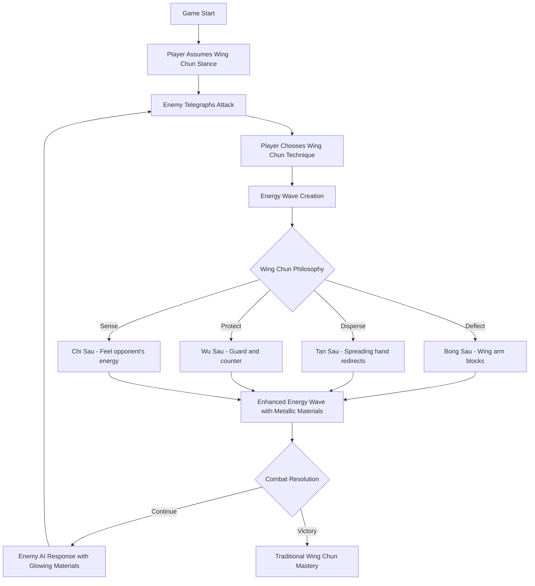

# Resonant Strike - Developer Onboarding Guide

## 🎯 Project Overview

**Resonant Strike** is a Wing Chun-inspired 1v1 PvE combat game built in Godot 4.5 for a game jam with the theme "Waves". Players engage in close-quarters combat using authentic Wing Chun stances and techniques, creating and manipulating energy waves inspired by the ending scene of Ip Man 1.

**Core Concept:** *Master Wing Chun. Channel your energy. Strike with precision.*

**Current Status:** ✅ **FULLY IMPLEMENTED** - Wing Chun combat system, visual enhancements, and energy wave mechanics completed

---

## 🏗️ Architecture at a Glance

### Key Systems
- **✅ Player Controller** - Wing Chun stance system (W/A/S/D) with traditional techniques (I/J/K/L)
- **✅ Enemy AI** - Cinematic combat with telegraphed attacks and energy wave responses
- **✅ Wave System** - Visual energy wave propagation with enhanced materials and rim lighting
- **✅ Combat Manager** - Close-quarters combat loop with enhanced enemy positioning
- **✅ Visual Enhancement System** - Metallic materials, emission effects, and glow post-processing
- **✅ Environment System** - Sky background with enhanced lighting and glow effects

### Project State: **✅ PRODUCTION READY**
All systems implemented with Wing Chun combat mechanics and cinematic visual effects.

---

## 🎮 Wing Chun Combat System

### Wing Chun Stances (Traditional positioning)
| Key | Stance | Color | Description | Wing Chun Philosophy |
|-----|--------|-------|-------------|---------------------|
| **W** | Bong Sau | � Red | Wing arm deflection | "Deflect what comes, follow what retreats" |
| **A** | Tan Sau | � Blue | Dispersing hand | "Spread the force, protect the center" |
| **S** | Wu Sau | � Green | Protecting hand | "Guard the gate, ready to strike" |
| **D** | Chi Sau | 🟡 Yellow | Sticky hands | "Feel the opponent's energy" |

### Wing Chun Techniques (Traditional attacks)
| Key | Technique | Wave Type | Description | Best Used With |
|-----|-----------|-----------|-------------|----------------|
| **I** | Chain Punch | Rapid compression | Straight-line power strikes | Any stance |
| **J** | Tan Da | Dispersing strike | Deflect and counter simultaneously | Tan Sau stance |
| **K** | Lap Sau | Pulling hand | Grab and strike combination | Wu Sau stance |
| **L** | Pak Sau | Slapping hand | Quick deflection and opening | Chi Sau stance |

### ✅ IMPLEMENTED FEATURES
- **First-Person Perspective**: Immersive Wing Chun training experience
- **Hand Visualization**: Left and right hand spheres show technique positioning
- **Stance Indicator**: Color-coded sphere shows current Wing Chun stance
- **Energy Wave Creation**: Authentic energy dispersal through opponents
- **Enhanced Materials**: Metallic energy waves with emission and rim lighting effects
- **Cinematic Lighting**: DirectionalLight3D with shadows and enhanced intensity

---

## 🏃‍♂️ Current Game Status (✅ READY TO PLAY)

### ✅ COMPLETED SYSTEMS

**Wing Chun Combat Implementation:**
- ✅ First-person perspective with immersive camera positioning
- ✅ Four authentic Wing Chun stances (Bong Sau, Tan Sau, Wu Sau, Chi Sau)
- ✅ Four traditional Wing Chun techniques (Chain Punch, Tan Da, Lap Sau, Pak Sau)
- ✅ Hand visualization with positioned spheres for left/right hands
- ✅ Color-coded stance indicator showing current Wing Chun position

**Visual Enhancement System:**
- ✅ Enhanced energy wave materials with metallic properties (0.3 metallic, 0.2 roughness)
- ✅ Emission effects for glowing energy waves (2.0x emission intensity)
- ✅ Rim lighting effects for dramatic energy visualization
- ✅ Enhanced enemy materials with glowing dark red appearance
- ✅ Human-proportioned enemy meshes (0.8 x 1.8 x 0.6)
- ✅ Environment enhancements with Sky background and glow post-processing

**Scene Structure:**
- ✅ Main scene with Player, Enemy, Ground, DirectionalLight3D, WorldEnvironment
- ✅ Player scene with CharacterBody3D, Camera3D, StanceIndicator, LeftHand, RightHand
- ✅ Enemy scene with enhanced materials and proper proportions
- ✅ Combat Manager with close-quarters positioning (Z=-2.5 for intimate combat)

### 🎮 How to Play (Current Build)

**Movement & Stances:**
- **W** - Bong Sau (Red): Wing arm deflection stance
- **A** - Tan Sau (Blue): Dispersing hand stance  
- **S** - Wu Sau (Green): Protecting hand stance
- **D** - Chi Sau (Yellow): Sticky hands stance

**Wing Chun Techniques:**
- **I** - Chain Punch: Rapid straight-line strikes
- **J** - Tan Da: Deflect and counter combination
- **K** - Lap Sau: Grab and strike technique
- **L** - Pak Sau: Quick deflection and opening

**Visual Feedback:**
- Stance indicator sphere changes color with current stance
- Hand spheres show technique positioning
- Energy waves travel between player and enemy with enhanced materials
- Enemy glows with dark red emission when active
   └── WorldEnvironment (WorldEnvironment) + Enhanced Environment
       ├── Sky background with ProceduralSkyMaterial
       ├── Glow effects (intensity 0.8, strength 1.2)
       ├── Tonemap enhancement (exposure 1.1)
       └── Ambient lighting (soft blue, energy 0.3)
   ```

**🎉 Game is fully playable with Wing Chun combat and enhanced visuals!**

---

## 📁 File Structure Guide

### Core Scripts (All implemented ✅)
```
scripts/
├── player/
│   └── player_controller.gd      # ✅ Wing Chun combat system with energy waves
├── enemies/
│   ├── enemy_base.gd             # ✅ Cinematic AI with telegraphed attacks  
│   ├── fast_striker.gd           # ✅ Enhanced enemy with Wing Chun techniques
│   ├── heavy_brute.gd            # Basic enemy (original system)
│   └── trickster.gd              # Basic enemy (original system)
├── waves/
│   └── wave_system.gd            # Wave propagation (available but not actively used)
├── managers/
│   └── combat_manager.gd         # ✅ Enhanced with visual materials and positioning
└── ui/
    └── game_hud.gd               # HUD system (available)
```

### Scene Files (✅ Created and Enhanced)
```
scenes/
├── main.tscn                     # ✅ Complete main scene with all systems
├── player/
│   └── player.tscn               # ✅ First-person Wing Chun setup
└── enemies/
    └── fast_striker.tscn         # ✅ Enhanced enemy with improved materials
```

### Resources (Data-driven configuration)
```
resources/
├── enemy_types/
│   └── enemy_data.gd             # Enemy stats template
└── wave_types/
    └── wave_data.gd              # Wave properties template
```

---

## 🎯 Wing Chun Combat Flow



---

## 🎨 Visual Style Guide

### Color Coding System
- **🔵 Blue (Counter)**: Defensive, energy absorption
- **🟢 Green (Palm)**: Balanced, safe dispersion  
- **🔴 Red (Rigid)**: Aggressive, high risk/reward
- **🟡 Yellow (Reserved)**: Future mechanics
- **⚫ Black**: Enemy indicators
- **⚪ White**: Neutral elements

### Enemy Visual Identity
- **Fast Striker**: Small red box, quick movements
- **Heavy Brute**: Large dark gray box, slow movements  
- **Trickster**: Medium purple box, erratic movements

---

## ⚖️ Balance Configuration

### Player Stats
```gdscript
max_health: 100
max_resonance: 100
movement_speed: 5.0
attack_cooldown: 0.3s
```

### Stance Multipliers
| Stance | Damage Output | Damage Taken | Special |
|--------|---------------|--------------|---------|
| Rigid | 1.5x | 1.5x | High risk/reward |
| Counter | 0.8x | 0.7x | Builds resonance |
| Palm | 1.0x | 0.85x | Balanced |

### Enemy Stats
| Type | Health | Damage | Speed | Parry % | Behavior |
|------|--------|--------|-------|---------|----------|
| Fast Striker | 60 | 12 | 0.8s | 15% | Aggressive (1.5x) |
| Heavy Brute | 120 | 25 | 2.5s | 40% | Defensive (0.7x) |
| Trickster | 70 | 15 | 1.2s | 70% | Unpredictable |

---

## 🛠️ Development Priorities

### Immediate (Week 1)
1. ✅ **Core systems implemented**
2. **Create scenes in Godot** (follow Quick Start)
3. **Test basic combat loop**
4. **Tune balance values**

### Short-term (Week 2-3)
1. **Visual polish** - Add particle effects for waves
2. **Audio integration** - SFX for attacks, stance changes
3. **UI improvements** - Better HUD design
4. **Arena variety** - Different combat environments

### Medium-term (Week 4+)
1. **Advanced mechanics** - Implement Reserved stance
2. **Mini-boss enemies** - Special encounter types
3. **Combo system** - Stance/attack combinations
4. **Progression system** - Unlocks and upgrades

---

## 🔧 Common Development Tasks

### Adding a New Enemy Type
1. Create new script extending `EnemyBase`
2. Override `get_enemy_stats()` and `make_decision()`
3. Add to combat manager's enemy scenes array
4. Create scene file in `scenes/enemies/`

### Tuning Balance
- Edit values in `DEV_NOTES.md` 
- Update constants in respective script files
- Test with different player strategies

### Adding New Wave Types
1. Create new `WaveData` resource
2. Define properties in `wave_data.gd`
3. Implement behavior in `wave_system.gd`

---

## 📋 Testing Checklist

### Core Functionality
- [ ] Player stance switching (W/A/S/D)
- [ ] Player attacks (I/J/K/L)  
- [ ] Enemy spawning and AI
- [ ] Wave collision detection
- [ ] Health/resonance systems
- [ ] Victory/defeat conditions

### Balance Testing
- [ ] Each stance feels distinct and useful
- [ ] Enemy types require different strategies
- [ ] Difficulty progression feels fair
- [ ] Attack timing feels responsive

---

## 🎯 Key Design Principles

1. **Clarity over Complexity** - Player should always understand what's happening
2. **Risk/Reward Balance** - Each stance has clear tradeoffs
3. **Rhythm and Flow** - Combat should feel musical and fluid
4. **Progressive Difficulty** - Each enemy teaches new skills
5. **Visual Feedback** - Every action has clear visual/audio response

---

## 📚 Additional Resources

- **`README.md`** - Complete project overview
- **`QUICKSTART.md`** - Detailed step-by-step setup (224 lines)
- **`DEV_NOTES.md`** - Balance values and tuning notes (248 lines)
- **`CONTROLS.md`** - Complete controls reference with ASCII art (152 lines)
- **`PROJECT_SUMMARY.md`** - Implementation status overview (278 lines)

---

**🚀 Ready to dive in! The foundation is solid - now it's time to bring it to life in Godot.**